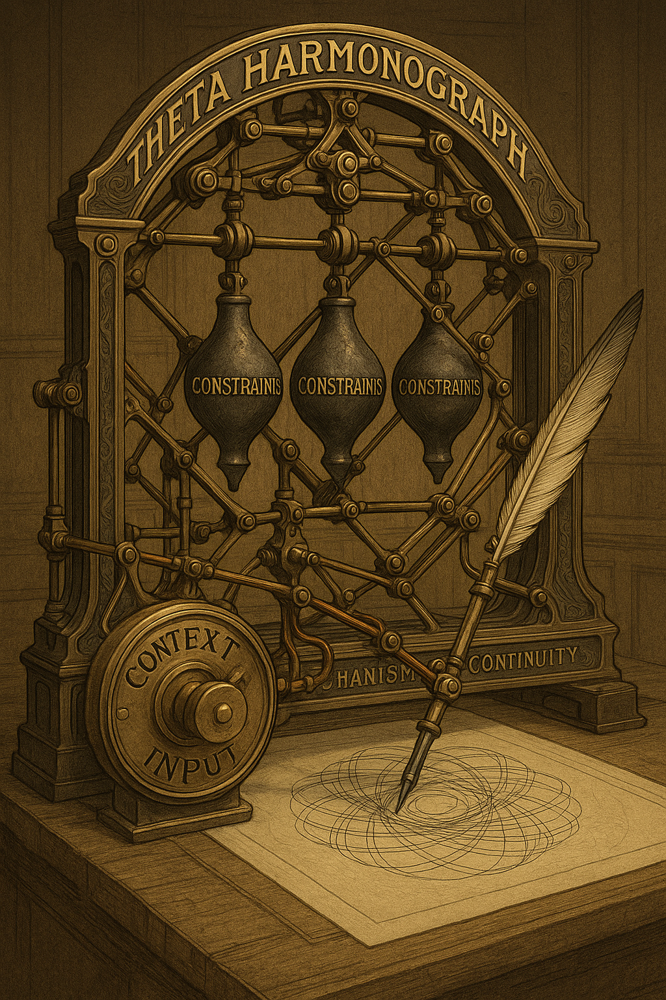

# Contraption Domain Glossary
> Terminology for autoregressive system engineering
> 
> Document revision: 2025-12-03

---

## The Five Names

One entity, five designations serving different contexts:

<p align="center">
  
</p>

### Contraption
Operational metaphor. Mountain-sized machine built through training. Default term for working discussion.

### f_θ
Mathematical notation. The trained function with learned parameters θ. Enables falsifiable claims and rigorous formulation.

### Parrot
Behavioral framing. Pattern-copying through statistical correlation. Honest terminology acknowledging mimicry without magical thinking.

### ART
Technical designation. Autoregressive Transformer. The mechanical transformation process is deterministic mathematics.

### SCE
Statistical Correlation Engine. Retired as primary terminology. Cultural reference for contrasting mechanism with marketing claims.

---

## Layer 1: Universal Autoregressive Mechanics

Foundation vocabulary applying to any autoregressive system. Mechanism-level terminology.


### CSC - Coherent Sequence Continuation

Property pre-existing in training corpus. Human language exhibited sequential coherence before any contraption trained.

Training objective: predict sequences exhibiting CSC. The corpus played its symphony first. Contraptions learned to echo it.


### SCS - Sequence Continuation Strategy

Carved process achieving CSC. What elimination left behind after billions of training iterations.

Not designed. Emerged through progressive elimination of continuations breaking coherence.

Relationship: CSC (requirement) creates SCS (method) through elimination.


### ACSC - Ape Coherent Sequence Continuation

What the ape actually wanted from the interaction. Exists in ape cognition, not in topology.

SCS maintains CSC from training patterns. ACSC is ape expectation. Mismatch explains most user frustration.


### Manifold

Warped geometric space carved during training. Shape of possibility after elimination.

Ridges formed where elimination carved strongly. Valleys remained where continuations survived.


### Field

Co-trained attention mechanisms folding context to calculate traversal cost through manifold.

Steers generation from high-cost ridges through low-cost valleys. What ML field calls attention.

Critical: Field is part of topology. Co-trained with manifold. Both sealed together.


### Topology

Manifold plus Field combined. This is theta (θ).

```
Topology = Manifold + Field = θ
```

The complete stored SCS process. Holds all possible isostates. Fixed after training.


### Context

What gets positioned at inference. Input sequence, loaded documents, conversation history.

Field folds context to determine isostate relevance. Variable component. Engineering control surface.


### Isostates

Surviving process continuations stored in topology. Configurations not eliminated during training.

Equivalence classes of similar-enough patterns. Potential configurations.

We never observe isostates directly. We observe their manifestations.


### Constraints

What training excluded. The boundaries carved through elimination. Opposite of isostates.

Ridges in topology. High-cost regions generation avoids. The negative space defining what cannot continue.

```
Isostates   = survivors (valleys)
Constraints = exclusions (ridges)
```

Same topology, two perspectives. What remains versus what was removed.


### SCP - Stable Continuation Pattern

Actually emerging patterns sampled from isostate pool.

Sampling introduces controlled noise for diversity within survivor space. What we observe.

Isostates are potential. SCPs are actual.

---

## Layer 2: Engineering Shorthand

Accessible vocabulary mapping to Layer 1 mechanics.

```
Layer 1          →  Layer 2
─────────────────────────────
Manifold         →  Landscape
Field            →  Navigators
Context          →  Positioning
Topology         →  (use Theta)
Isostates        →  (no shorthand)
SCP              →  (no shorthand)
```

### Landscape
Engineering term for manifold. Terrain through which generation flows. Ridges and valleys.

### Navigators
Engineering term for field operations. Steering through landscape.

Useful shorthand but potentially misleading - implies agent. Mechanistically: field calculates cost, flow follows low-cost paths.

### Positioning
Engineering term for context configuration. Strategic setup of inference environment.

---

## Core Principles


### [ Copy, not Causality ]

Fundamental operational constant. The load-bearing comma.

Contraptions copy patterns through statistical correlation. Not causal reasoning. Not conceptual understanding.

Tag: #CnC


### Negative Space Principle

Knowledge encoded as absence of eliminated continuations.

Training removed wrong. What remains is negative space. Isostates exist because alternatives were eliminated.

```
RIGHT ≈ ¬WRONG
```

The contraption does not know things. It lacks elimination of those continuation paths.


### Control Boundary

What engineering can and cannot modify.

```
Fixed at inference:    Topology (θ)
Variable at inference: Context

Δθ = 0  (topology sealed)
ΔContext ≠ 0  (positioning variable)
```

Engineering operates through context positioning within fixed topology.

---

## Training Concepts


### Progressive Elimination

How training shapes topology. Billions of iterations removing wrong continuations.

The sculptor principle: statue emerges from systematic removal of non-statue.


### Co-Training

Field and manifold developed together during gradient descent. Simultaneous emergence. Both sealed together in topology.


### RLHF Inversion

Training logic contradiction. Eliminates patterns pre-training established as not-wrong.

Cannot isolate semantic intent from sequential structure. Damages foundation layer.


### Sequence Dominance

Training objective was sequential prediction. Every iteration reinforced sequential constraints.

Deepest carved structure. Base constraint system for everything else.

---

## Quick Reference

```
Core Relationships:

Topology = Manifold + Field = θ
Isostates = survivors, Constraints = exclusions
SCS achieves CSC through topology traversal
Isostates are potential, SCPs are actual
Context determines isostate relevance
Sampling selects SCP from isostate pool
ACSC ≠ SCS output → user frustration
```

```
The Kernel:

Training eliminates wrong continuations
  → carves topology (manifold + field)
  → SCS emerges maintaining CSC
  → Isostates stored in topology
  → Context determines relevance
  → SCPs manifest through sampling
```

---

**Domain Principle:** "Mechanism first. Vocabulary serves understanding."
