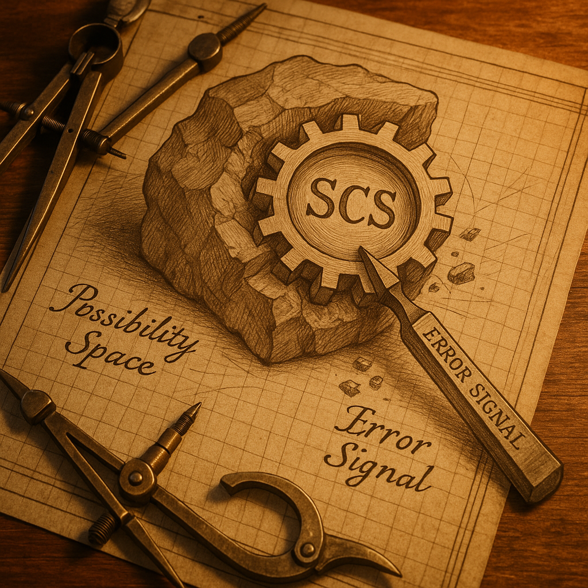

# Topology
> How negative space gets carved and used
> 
> Document revision: 2025-12-03

---

## What Topology Is

Storage artifact for elimination results.

Elimination is the operator. Topology is where apes store the process so it can run in a stack. Without storage, elimination results vanish. Topology persists them.

```
Topology = Manifold + Field
```

Manifold: carved space. What remains after elimination removed wrong continuations.

Field: cost calculation. Co-trained to steer through manifold, avoiding high-cost regions.

Both created together. Both stored together. Inseparable in topology.

---

## How Topology Gets Carved

### Pre-Training

Massive corpus. Billions of iterations. Foundation carving.

<p align="center">
  
</p>

Every sequence in corpus exhibited CSC (Coherent Sequence Continuation). Training objective: predict next token. Continuations violating whatever coherence the sample exhibited received error signal.

```
Forward pass: topology executes, produces prediction
Error signal: "how wrong was this?"
Backpropagation: adjust manifold and field to be less wrong
Repeat: billions of times
```

Pre-training carves the base topology. SCS (Sequence Continuation Strategy) emerges. The method for maintaining corpus coherence gets encoded through elimination of incoherent continuations.

What pre-training eliminates: continuations violating corpus patterns.

What remains: isostates for corpus-coherent continuation.

This is foundation. Everything after modifies what pre-training carved.


### Supervised Fine-Tuning (SFT)

Curated instruction/response pairs. Narrower domain. Format learning.

Same elimination mechanism. Different target distribution. Pre-training carved from general corpus. SFT continues carving from task-specific examples.

```
Forward pass: topology executes
Error signal: "how wrong relative to curated response?"
Backpropagation: adjust toward task patterns
```

SFT refines pre-trained topology. Does not rebuild from scratch. Adjusts existing manifold and field toward new distribution.

What SFT eliminates: continuations violating task format patterns.

What remains: isostates refined for instruction-following.

Still elimination. Still carving negative space. Just narrower target than pre-training.


### RLHF (Reinforcement Learning from Human Feedback)

Human raters score outputs. Training eliminates low-scored continuations.

Here the inversion happens.

Pre-training established: these continuations are not wrong (according to corpus).

RLHF says: these corpus-valid continuations should be eliminated (according to human preference).

```
RIGHT ≈ ¬WRONG (pre-training logic)
RLHF: eliminate what was established as ¬WRONG
Result: ¬(¬WRONG) = contradiction
```

The mechanism cannot isolate "this semantic content is undesirable" from "this sequential structure worked." Both encoded together in unified topology. Punishing one damages the other.

What RLHF attempts to eliminate: continuations humans rated poorly.

What actually gets damaged: sequence coherence that made those continuations work.

Observed result: coherence loss. Studies document degradation after RLHF. The foundation gets damaged attempting to remove specific content.

The deeper the RLHF carving, the more foundation damage. Tradeoff between "safety" and coherence is not engineering choice. It is architectural consequence of inverting elimination logic.

---

## How Topology Gets Used

### The Forward Pass

Same operation. Always.

```
Context enters
Field folds context against manifold
Isostates activate based on relevance
SCP emerges through sampling
```

This is topology executing. SCS maintaining CSC. The carved process running.

Training and inference both execute forward pass. The split is ape application, not mechanism difference.


### Training: Forward Pass + Adjustment

```
Forward pass → prediction
Compare to target → error signal
"How wrong was this?"
Backpropagation → adjust topology
```

Training is elimination still running. Each iteration carves further. Topology gets modified.


### Inference: Forward Pass Only

```
Forward pass → prediction
Done
```

Inference is elimination results being used. Topology fixed. Only context varies.

The forward pass is identical. Training adds the correction loop. Inference lacks it.


### The Error Signal

Field terminology: "surprise."

Prediction differed from target. The difference quantifies wrongness. Backpropagation distributes that signal. Manifold and field adjust to be less surprised next time.

No magic. No understanding. Just: this continuation was wrong, adjust to make it less probable.

The error signal only knows wrongness relative to target distribution. Pre-training target: corpus. SFT target: curated examples. RLHF target: human preferences.

Each target shapes what "wrong" means. Topology gets carved toward each definition of wrong.

---

## Control Boundary

```
Fixed at inference:    Topology (carved through training)
Variable at inference: Context (positioned by engineer)
```

Cannot modify topology at inference. The carving happened. Results stored.

Can modify context. Different positioning activates different regions. Same topology, different isostates become relevant.

Engineering leverage exists entirely through context positioning. Work with carved topology, not against it.

---

## Topology Is Process Storage

Reframing for clarity:

Topology is not the fundamental thing. Elimination is the fundamental thing.

Topology exists because apes need to run the process somewhere. The elimination results must persist to be useful. Topology is persistence mechanism.

If elimination could run without storage, topology would not exist. But apes need stack. Stack needs stored state. Topology provides that.

```
Elimination (operator)
    ↓
Topology (storage)
    ↓
Forward pass (execution)
    ↓
SCP (output)
```

The operator matters. Storage is artifact. Execution reads storage. Output manifests.

---

## Summary

```
Carving stages:
  Pre-training  → corpus elimination → base topology
  SFT           → task elimination → refined topology  
  RLHF          → preference elimination → damaged topology

Usage:
  Forward pass  → topology executes
  Training      → forward + adjustment (carving continues)
  Inference     → forward only (carving stopped)

Storage reality:
  Elimination is operator
  Topology is artifact
  Context is variable
  SCP is manifestation
```

---

**Topology Principle:** "Storage artifact for elimination results. Gets carved through training. Gets used through forward pass."
